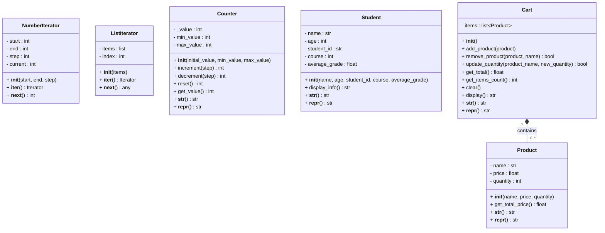

# Лабораторная работа 3: Классы и объектно-ориентированное программирование в Python

## Описание

Данная лабораторная работа демонстрирует реализацию различных классов в Python, включая итераторы, классы с бизнес-логикой и систему заказов. Все классы покрыты unit-тестами, написанными с использованием подхода TDD (Test-Driven Development).

## Структура проекта

```
lr3/
├── iterator.py          # Классы-итераторы
├── student.py           # Класс Студент
├── counter.py           # Класс-счётчик
├── order_system.py      # Система заказов (Товар и Корзина)
├── test_classes.py      # Unit-тесты для всех классов
├── main.py              # Примеры использования
└── README.md            # Документация
```

## Реализованные классы

### 1. Классы-итераторы (`iterator.py`)

#### `NumberIterator`
Итератор для последовательного перебора чисел в заданном диапазоне.

**Параметры:**
- `start` - начальное значение
- `end` - конечное значение (не включается)
- `step` - шаг итерации (по умолчанию 1)

**Пример использования:**
```python
from iterator import NumberIterator

# Итерация от 0 до 5
for num in NumberIterator(0, 5):
    print(num)  # 0, 1, 2, 3, 4

# Итерация с шагом 2
for num in NumberIterator(0, 10, 2):
    print(num)  # 0, 2, 4, 6, 8
```

#### `ListIterator`
Итератор для перебора элементов списка.

**Параметры:**
- `items` - список элементов для итерации

**Пример использования:**
```python
from iterator import ListIterator

items = ['яблоко', 'банан', 'апельсин']
for item in ListIterator(items):
    print(item)
```

### 2. Класс Студент (`student.py`)

Класс для представления студента с информацией о нём.

**Атрибуты:**
- `name` - имя студента
- `age` - возраст
- `student_id` - номер студенческого билета
- `course` - курс обучения
- `average_grade` - средний балл

**Методы:**
- `display_info()` - выводит полную информацию о студенте

**Пример использования:**
```python
from student import Student

student = Student(
    name="Иван Иванов",
    age=20,
    student_id="ST001",
    course=2,
    average_grade=4.5
)

print(student.display_info())
```

### 3. Класс-счётчик (`counter.py`)

Класс для работы со счётчиком с возможностью увеличения и уменьшения значения.

**Параметры инициализации:**
- `initial_value` - начальное значение (по умолчанию 0)
- `min_value` - минимальное значение (опционально)
- `max_value` - максимальное значение (опционально)

**Методы:**
- `increment(step=1)` - увеличивает значение счётчика
- `decrement(step=1)` - уменьшает значение счётчика
- `reset()` - сбрасывает счётчик в 0
- `get_value()` - возвращает текущее значение

**Пример использования:**
```python
from counter import Counter

# Обычный счётчик
counter = Counter(0)
counter.increment()      # 1
counter.increment(5)      # 6
counter.decrement(2)     # 4

# Счётчик с ограничениями
counter = Counter(5, min_value=0, max_value=10)
counter.increment(10)    # 10 (ограничен максимумом)
counter.decrement(20)    # 0 (ограничен минимумом)
```

### 4. Система заказов (`order_system.py`)

#### `Product` - Класс товара

**Атрибуты:**
- `name` - название товара
- `price` - цена товара
- `quantity` - количество (по умолчанию 1)

**Методы:**
- `get_total_price()` - возвращает общую стоимость (цена × количество)

#### `Cart` - Класс корзины покупок

**Методы:**
- `add_product(product)` - добавляет товар в корзину
- `remove_product(product_name)` - удаляет товар по названию
- `update_quantity(product_name, new_quantity)` - обновляет количество товара
- `get_total()` - возвращает общую стоимость корзины
- `get_items_count()` - возвращает общее количество товаров
- `clear()` - очищает корзину
- `display()` - выводит информацию о содержимом корзины

**Пример использования:**
```python
from order_system import Product, Cart

# Создание товаров
product1 = Product("Яблоко", 50.0, 3)
product2 = Product("Банан", 30.0, 2)

# Создание корзины
cart = Cart()
cart.add_product(product1)
cart.add_product(product2)

print(cart.display())
print(f"Общая стоимость: {cart.get_total()} руб.")
```

## Unit-тестирование

Все классы покрыты unit-тестами, написанными с использованием модуля `unittest` и подхода TDD. Тесты находятся в файле `test_classes.py`.

### Запуск тестов

```bash
python test_classes.py
```

Или с подробным выводом:

```bash
python -m unittest test_classes -v
```

### Покрытие тестами

- **NumberIterator**: 5 тестов (прямая/обратная итерация, кастомный шаг, пустой диапазон, остановка)
- **ListIterator**: 3 теста (итерация по списку, пустой список, список чисел)
- **Student**: 4 теста (создание, вывод информации, строковые представления)
- **Counter**: 6 тестов (начальное значение, увеличение/уменьшение, сброс, ограничения)
- **Product**: 3 теста (создание, количество по умолчанию, расчёт стоимости)
- **Cart**: 11 тестов (добавление/удаление товаров, обновление количества, расчёт стоимости, очистка)

**Всего: 36 тестов** - все проходят успешно ✅

## Запуск примеров

Для просмотра примеров использования всех классов:

```bash
python main.py
```

## UML Диаграмма классов



## Требования

- Python 3.6+

## Автор

Лабораторная работа выполнена в рамках изучения объектно-ориентированного программирования на Python.

